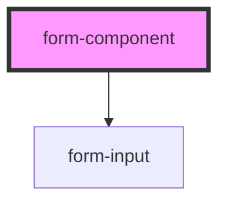

# form-component

<!-- Auto Generated Below -->

## Properties

| Property   | Attribute   | Description | Type      | Default |
| ---------- | ----------- | ----------- | --------- | ------- |
| `stepForm` | `step-form` |             | `boolean` | `false` |

## Dependencies

### Depends on

- [form-input](../form-input)

### Graph

---

_Built with [StencilJS](https://stenciljs.com/)_
