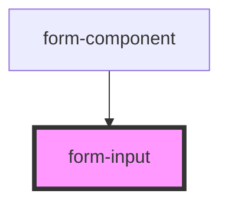

# form-input

<!-- Auto Generated Below -->

## Properties

| Property | Attribute | Description    | Type     | Default |
| -------- | --------- | -------------- | -------- | ------- |
| `label`  | `label`   | The first name | `string` | `null`  |

## Dependencies

### Used by

 - [form-component](../form-component)

### Graph

----------------------------------------------

*Built with [StencilJS](https://stenciljs.com/)*
